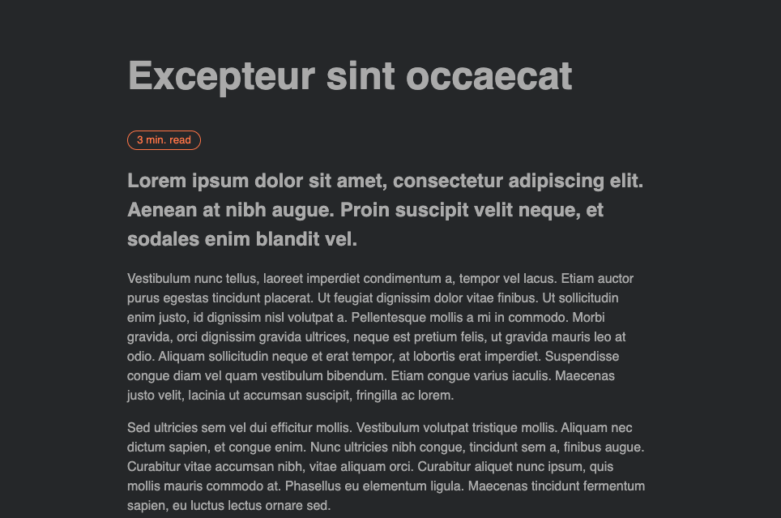

# vue-reading-time
## npm package

vue-reading-time provides an estimate of how long an article or blog will take for the average adult to read.

Install
```js
npm install vue-reading-time
```
```js
yarn add vue-reading-time
```

#### DEMO https://vue-article-reading-time.netlify.app
#### REPO https://github.com/BoraKucukkara/vue-reading-time

#



Usage
```html
<script>
import {VueReadingTime} from 'vue-reading-time'
export default {
  components:{VueReadingTime}
}
</script>
<template>
  <vue-reading-time element="article-ref" />
  <!-- 
    Pass elements ref as prop to component, can be dynamized for v-for by using :ref="some-article.id"
    Component gets all text in element and calculates approximate reading time 
    -->
  <article ref="article-ref">
      <h1>Excepteur sint occaecat</h1>
      <h2>Lorem ipsum dolor sit amet, consectetur adipiscing elit. Aenean at nibh augue. Proin suscipit velit neque, et sodales enim blandit vel. </h2>
      <p>Vestibulum nunc tellus, laoreet imperdiet condimentum a, tempor vel lacus. Etiam auctor purus egestas tincidunt placerat. Ut feugiat dignissim dolor vitae finibus. Ut sollicitudin enim justo, id dignissim nisl volutpat a. Pellentesque mollis a mi in commodo. Morbi gravida, orci dignissim gravida ultrices, neque est pretium felis, ut gravida mauris leo at odio. Aliquam sollicitudin neque et erat tempor, at lobortis erat imperdiet. Suspendisse congue diam vel quam vestibulum bibendum. Etiam congue varius iaculis. Maecenas justo velit, lacinia ut accumsan suscipit, fringilla ac lorem.</p>
  </article>
</template>

```

Style

```css
You can style component with the .vue-reading-time class
```

https://github.com/BoraKucukkara